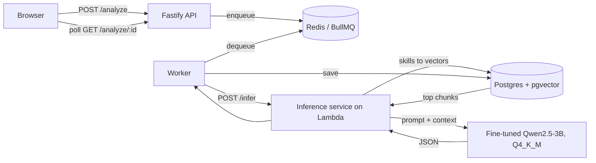

# HireLens

Paste a resume and a job description, get back what a good recruiter would write on the
scorecard: a fit score, the gaps against the role, and interview questions worth asking.

The point of the project is not the JSON. A frontier model produces that easily. The point is
that the JSON comes from **a 3B open-source model fine-tuned for this one task, quantized to
4-bit, and served on demand** — grounded by retrieval over a knowledge base I wrote, for a
running cost of zero.

Live demo: _add your Vercel URL here_

---

## What it does



The API returns a job id immediately and the browser polls, because inference takes seconds
and a cold Lambda takes rather more than that. Holding the HTTP request open for the duration
would fall over the first time two people tried the demo at once.

## Repository layout

```
apps/
  api/          Fastify + Prisma + BullMQ. Validates input, queues work, serves results.
  ml-service/   Python. Data generation, training, RAG, and the inference service.
  web/          Next.js demo.
packages/
  shared/       analysis.schema.json and its zod mirror. One contract, two languages.
```

## Running it locally

```bash
cp .env.example .env            # then fill in DATABASE_URL
docker compose up -d            # Postgres with pgvector, and Redis
npm install

cd apps/api && npx prisma migrate dev && cd ../..

cd apps/ml-service
pip install -r requirements-dev.txt
python -m rag.ingest                              # load the knowledge base
uvicorn inference.server:app --port 8000          # MODEL_BACKEND=stub until Phase 5 is done
```

Then, in separate terminals:

```bash
npm run dev:api
npm run dev:worker
npm run dev:web
```

## Tests

```bash
cd apps/api && npm test          # 14 tests: input validation, model-output handling
cd apps/ml-service && pytest     # 59 tests: extraction, chunking, prompts, curation, eval
```

## Decisions worth explaining

**Why fine-tune a small model rather than prompt a large one.** Prompting works, and costs a
per-request API call forever. Fine-tuning moves the output format into the weights, so the
prompt gets shorter, the output gets more reliable, and the marginal cost of a request drops
to CPU time I am not paying for. The interesting engineering is in the dataset, not the model.

**Why the dataset is curated down so hard.** Roughly 400 generated examples become about 300.
A teacher mistake that survives curation does not stay one bad example — the student learns it
as a pattern. Every example is checked against the schema, checked for internal coherence
(a 95 fit score alongside three severe gaps is not), and checked that its gaps are actually
grounded in the job description rather than invented.

**Why the grounding check is narrower than it looks.** The obvious version — compare the gap's
words against the job description's words — rejects every correct gap phrased differently from
the posting. A JD asking for "mentoring junior engineers" would see the gap "Team leadership"
as an invention. Those are most of the semantically interesting gaps, so lexical matching
would systematically strip soft-skill gaps out of the dataset and teach the model never to
produce them. So gaps are resolved through the skill vocabulary first, and only single-word
unknown terms fall back to word matching.

**Why RAG at all, when the model is already fine-tuned.** Fine-tuning taught the model the
shape of the task. It did not teach it a current, comprehensive bank of good interview
questions per technology. Retrieval changes the model's job from "invent a good Kubernetes
question from memory" to "adapt one from this material", which is a much easier task to do
reliably at 3B parameters.

**Why pgvector instead of a managed vector database.** The corpus is under a hundred chunks.
A second service with its own availability, billing and client library would be infrastructure
in exchange for nothing. Postgres was already there.

**Why one query per skill instead of one for the whole resume.** Embedding a whole resume
produces the average of everything in it, which is close to nothing in particular, and
retrieves generic chunks. Embedding "Kubernetes" retrieves Kubernetes material.

**Why training prompts contain the retrieval block.** At request time the prompt has a
reference-material section. If training never showed one, the model meets an unfamiliar block
at inference and quietly gets worse — output that is still plausible, just weaker, which is
nearly invisible in logs. `training/prepare_dataset.py` runs retrieval too, so the two formats
cannot drift. This means **Phase 6 has to run before Phase 4**, unlike the original build order.

**Why Lambda for the model and a normal host for the API.** The model is the piece that is
expensive to keep warm and cheap to run occasionally, which is exactly the serverless tradeoff.
The API, worker and Redis are thin and always-on, and live on a small free-tier host. Lambda's
Always Free allowance is not time-limited, so the expensive part stays free indefinitely.

**The known limitation:** a cold Lambda takes roughly 15 seconds to pull the image and load the
model. The UI says so rather than spinning silently. Provisioned concurrency would fix it and
reintroduce an always-on cost, which defeats the reason for choosing Lambda.

## Build order

The guide this was built from runs 0 through 10 in order. One change: ingest the knowledge
base (Phase 6) before fine-tuning (Phase 4), for the prompt-format reason above.

| Phase | What | Needs |
|---|---|---|
| 1–2 | Repo, API, schema | Node, Docker, Neon |
| 6 | Knowledge base, embeddings, retrieval | Postgres + pgvector |
| 3 | Synthetic data generation and curation | Gemini or Groq free tier |
| 4 | QLoRA fine-tune | Free Colab T4 |
| 5 | Merge, convert to GGUF, quantize to Q4_K_M | Colab or a local machine |
| 7 | Inference service wired to the queue | — |
| 8 | Lambda, ECR, API Gateway | AWS account |
| 9–10 | Frontend, eval set, polish | Vercel |
